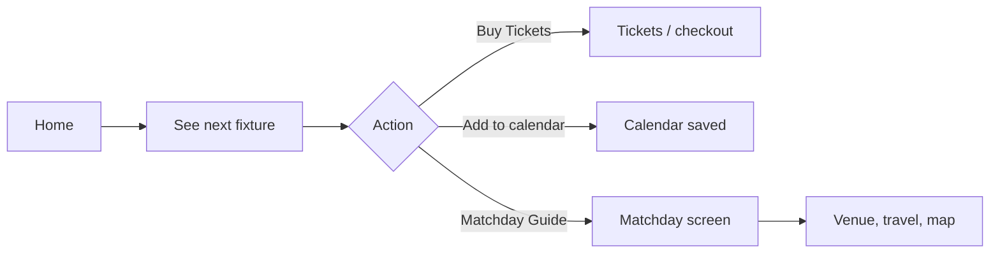
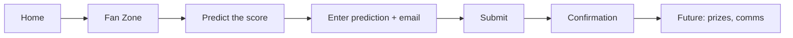
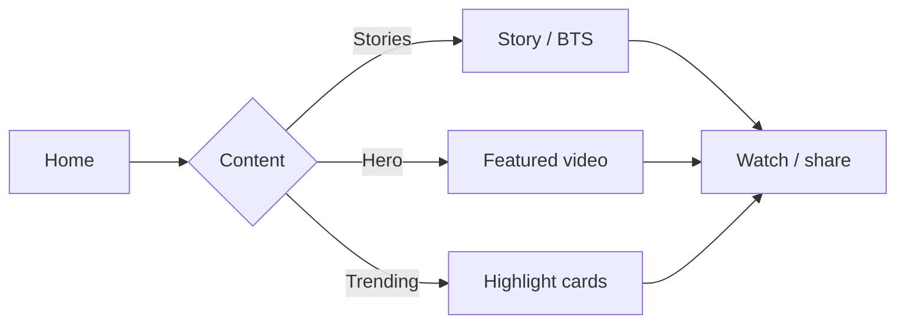
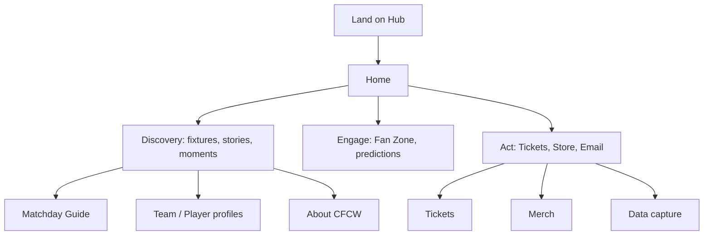

# Chelsea FC Women Hub — Hackathon Submission

This document outlines the concept, structure, and key ideas behind this prototype for a **Chelsea FC Women hub**. The app is a lightweight, mid-fi prototype built to showcase layout, hierarchy, and core fan journeys.

---

## Context: Current site and opportunity

On chelseafc.com today:

- **Women’s Homepage** — Does not exist. Clicking “Women’s Team” in the header goes to Women’s Fixtures/Results. That’s a missed opportunity for a true central hub for CFCW: a space to be bold, showcase the Women’s team, home for hype/video/standout moments, with clearer routes into tickets and merch and creative ways to capture fan data.
- **Women’s Matchday Guide** — Exists ([chelsea-womens-ticket-guide](https://www.chelseafc.com/en/chelsea-womens-ticket-guide)). Opportunity to rethink structure and UX, drive fans into the ticket journey, and orient new fans (getting to Stamford Bridge, chants, etc.).
- **Player & Staff Profiles** — Exist ([teams/chelsea-women](https://www.chelseafc.com/en/teams/chelsea-women)). Opportunity to present info in richer ways (e.g. highlights per player, player chatbots).
- **About Chelsea Women** — Exists ([about-chelsea-fc-women](https://www.chelseafc.com/en/about-chelsea-fc-women)). Largely static; opportunity to better connect past, present, and future.

This prototype proposes a **single Women’s Hub** (with Chelsea branding) that acts as the missing homepage and ties these destinations together with clearer journeys and data capture.

---

## 1. Lightweight prototype

- **Format:** Clickable, scrollable web app (React + Vite). Runs in browser; mobile-first layout. Uses **Chelsea FC logo** in the header (“Women’s Hub”).
- **Fidelity:** Mid-fi — real navigation, forms, and content hierarchy; placeholder imagery and copy where needed.
- **What it shows:**
  - **Layout & hierarchy:** Home feed (hero video, next match, quick links to Matchday Guide and Store, Fan Zone, trending moments), dedicated Matchday and Team Profiles areas, About section with honours/history/songs and links to official chelseafc.com pages.
  - **Key journeys:** Discovery (content + next match), engagement (Fan Zone prediction), tickets (Buy Tickets + Matchday Guide), merch (Official Store link), data capture (email via Predict the Score).
- **Scope:** Enough detail to explain the idea; not production-ready (no real checkout, auth, or CMS). About screen includes an “On chelseafc.com” section linking to the official Women’s Matchday Guide, Player & Staff Profiles, and About Chelsea FC Women.

**Run locally:** `npm install` then `npm run dev`.

---

## 2. Clear concepts and ideas

**Big-picture:** A single, fan-first **Chelsea Women hub** that:

- **Centres CFCW identity** — Women’s team as the hero (fixtures, players, moments, history), with a distinct but recognisable Chelsea look and feel.
- **Connects matchday and beyond** — From “when’s the next game?” and “how do I get there?” to “predict the score” and “watch the best moments,” so the hub works for attendees and remote fans.
- **Drives action** — Clear paths to tickets, merch, and sign-up (e.g. prediction + email) without cluttering the main experience.
- **Surfaces “big moments”** — Exclusive or featured video, trending moments, and stories so iconic CFCW moments stay easy to find and share.

**Principles:** One place for CFCW; mobile-first; discovery → engagement → action (tickets/merch/data); lightweight and scannable.

---

## 3. Proposed information architecture

How the Women’s area could be structured and connected:

```
CFCW Hub (root)
│
├── Home
│   ├── Stories (behind-the-scenes / moments)
│   ├── Featured hero (video / campaign)
│   ├── Next fixture (with Tickets + Add to calendar)
│   ├── Quick links → Matchday Guide, Official Store
│   ├── Fan Zone (e.g. Predict the Score + email capture)
│   └── Trending moments (highlights / analysis)
│
├── Matchday
│   ├── Venue switch (Stamford Bridge | Kingsmeadow)
│   ├── “Are you attending?” (personalised content)
│   ├── Travel, gates, stadium map
│   └── Matchday tips / FAQs
│
├── Team & profiles
│   ├── Squad (with position filter)
│   │   └── Player profile (bio, stats, photo, link to merch/related)
│   └── Staff (coach, GM, etc.)
│
└── About CFCW
    ├── Club history & timeline
    ├── Honours
    └── Legacy / future (optional deeper pages)
```

**Connections:**

- Home “Next fixture” → **Tickets** (external or future checkout) and **Matchday** (guide).
- Home “Matchday Guide” / “Official Store” → **Matchday** screen and external store.
- Home “Fan Zone” → **Data capture** (email) and future gamification.
- **Roster** → **Player profile** (drill-down); profile can link to merch or related content.
- **About** can link back to Home or to future “History” / “Academy” sub-pages.

---

## 4. User flow diagrams

### A. Discovery → Tickets

Fan discovers the next game and gets to tickets or matchday info.



### B. Engagement → Data capture

Fan engages with a feature that captures contact details.



### C. Discovery → Content (big moments)

Fan finds and consumes CFCW moments.



### D. Full journey (high level)



---

## 5. Key features and interaction ideas

- **Stories rail (Home)** — Bite-sized, story-style updates (training, matchday, players, academy). Shows how CFCW content can feel native and scrollable; could later drive to full articles or video.
- **Featured hero / exclusive video** — One big “moment” (e.g. “The Derby Win: Unseen Angles”) with play CTA. Explores how to present one flagship piece without crowding the feed.
- **Next fixture card** — Single place for “next up”: teams, date, time, competition. CTAs: **Buy Tickets**, **Add to calendar**. Direct link into Matchday Guide for “I’m going” fans.
- **Quick links (Matchday Guide, Official Store)** — Two tiles from Home into key journeys (plan your visit, buy merch). Keeps conversion paths visible without taking over the layout.
- **Fan Zone — Predict the score** — Gamified engagement: user enters score prediction + email; sees confirmation. Demonstrates a lightweight way to capture data and reward fans (e.g. signed shirt); could extend to leagues, badges, or notifications.
- **Trending moments** — Horizontal scroll of highlight cards (goals, analysis). New way to surface “big CFCW moments” beyond a single hero; each card could open full video or recap.
- **Matchday — “Are you attending?”** — Simple yes/no personalisation: attending fans get travel, gates, map; others get watch info or next steps. Shows how one screen can branch by intent.
- **Matchday — Venue toggle** — Stamford Bridge vs Kingsmeadow. Reflects real CFCW fixture mix and keeps information architecture clear per venue.
- **Team profiles (Squad / Staff)** — Filterable squad list and staff; tap through to player profile (bio, number, position, photo). Foundation for “meet the team” and future links to merch or stats.
- **About CFCW — Timeline** — Honours and history in a timeline. Gives the Women’s hub a clear “story” and a place for legacy content.

---

## Summary

| Hackathon ask | How this submission addresses it |
|---------------|-----------------------------------|
| **Lightweight prototypes** | Mid-fi, clickable web app with Home, Matchday, Roster, Player profile, About; shows layout, hierarchy, and key journeys (discovery, engagement, tickets, merch, data capture). |
| **Clear concepts** | One fan-first CFCW hub: centre identity, connect matchday and beyond, drive action, surface big moments. |
| **Information architecture** | Proposed IA with Home, Matchday, Team/Profiles, About; how they connect and where tickets/merch/capture live. |
| **User flow diagrams** | Mermaid flows for discovery→tickets, engagement→data capture, discovery→content, and high-level full journey. |
| **Key features / interaction ideas** | Stories, hero video, next fixture + tickets, quick links, Fan Zone prediction + email, trending moments, matchday personalisation and venue toggle, team profiles, About timeline. |

---

*This prototype is for hackathon exploration only. It is not an official Chelsea FC product.*
